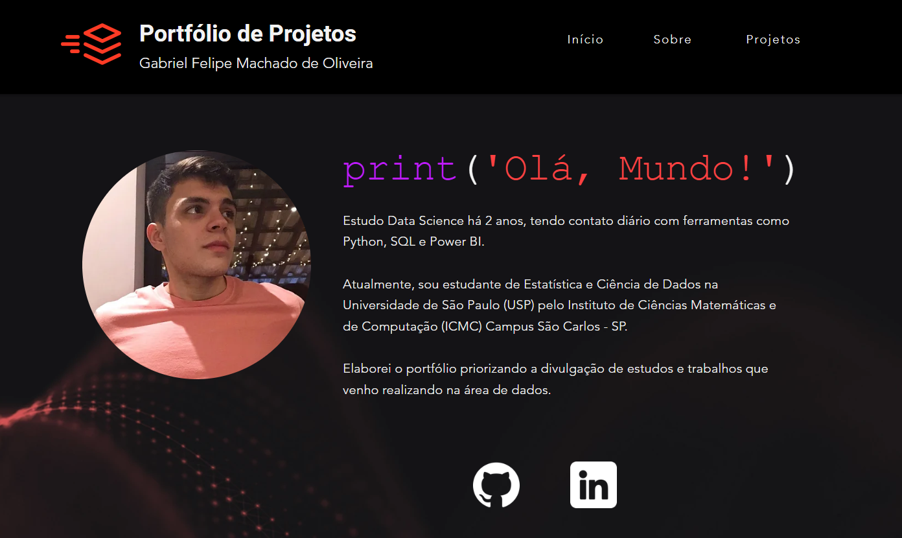

- 💻 Analista de Finanças Pleno;
- 📊 Estudante de Estatística e Ciência de Dados no ICMC/USP (Instituto de Ciências Matemáticas e de Computação);
- 🚀 Em busca de ajuda em tópicos de Data Science e Data Analytics.

Acompanhe meus projetos: https://bit.ly/3xJT6VU

##

  

##
  
### Tecnologias:
&nbsp;
&nbsp;
&nbsp;
&nbsp;
&nbsp;

### Contato:

 
   

 

